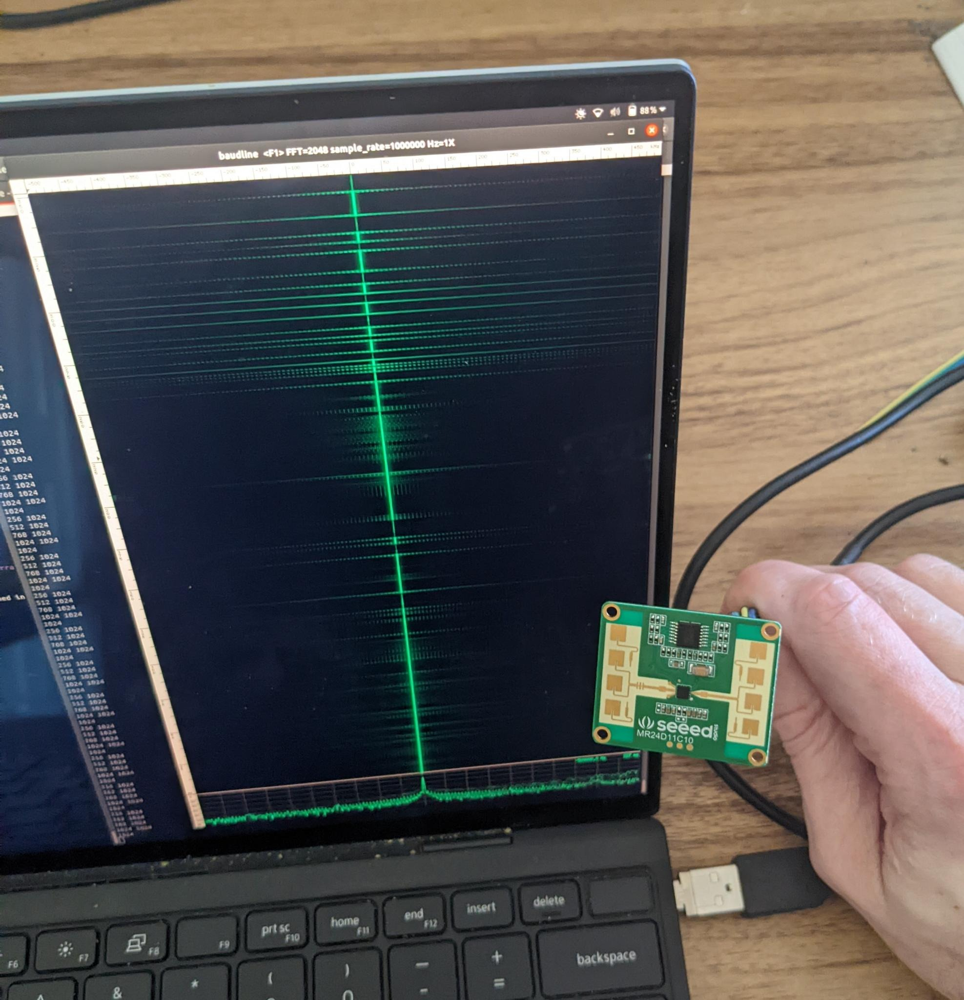

# custom firmware on 24GHz Seeed radar modules

I figured out that the MicRadar-branded LQPF48 package on Seeed's MR24D11C10 radar module is actually an AT32F403ACGT7, which turns out to be a capable Cortex-M4F MCU with a 12-bit ADC.

In normal operation, the AT32 samples downconverted IQ from the radar IC (an Infineon BGT24LTR11), does some math, and outputs human/no-human/human-fall-down over UART.

The AT32 also features a USB full-speed controller, and the USB pins are populated on the 5V pin header on the module.

One thing lead to another, and I prototyped some firmware which samples IQ at ~285600 samples/second, and streams it over USB to a Python script on the host. The sample rate is constrained by USB speed, but the MCU itself can sample at least 2Ms/s.

## proof-of-concept

This is very much a proof-of-concept and doesn't include any control over eg. tuning, but should be a good place to start if you too impulse-bought some radar-modules from Seeed :)

### requirements

- Seeed 24GHz human-detector radar module (MR24D11C10 or MR24BSD1)
- sacrificial USB cable
- J-Link (or some other OpenOCD-compatible SWD programmer)

### wire up the module for USB and SWD

- I connected a USB cable by replacing one end with some jumper wires.
- If you're using something other than a J-Link for SWD, you'll need to update the OpenOCD invocation in the Makefile.
- [pinout.jpg](pinout.jpg)

### patch and build openocd

Patch OpenOCD to recognize the AT32F403A as an STM32F1xx:

```
git submodule update --init
cd openocd
git apply ../openocd.patch
./bootstrap
./configure
make -j
cp openocd/src/openocd openocd/tcl/
cd ..
```

### build and flash the firmware

```
make
make flash
```

### stream into baudline

Make sure [baudline](https://baudline.com/) is in your path, and then run the following command to reset the module and start streaming IQ to baudline.

```
make reset && sleep 1 && ./stream-iq.py | baudline -stdin -channels 2 -quadrature -record -fftsize 2048 -flipcomplex
```


